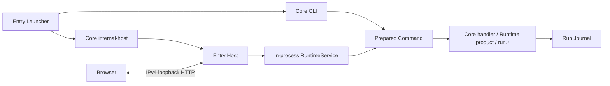

# SWAW Kit Proj 协议地图与开发计划

## 1. 方向

Proj 下一阶段不应继续从“Core 还要支持什么功能”出发，而应改成：

> **先设计领域理想中的自治命令模块，再识别它无法独立保证的跨领域不变量；只有这些不变量才进入 Core 协议。**

Core 类似宪法：只维护身份、发现、路径、执行、进程、发布代、Host 和 Journal 等必须全局一致的规则。命令模块拥有业务参数、状态、迁移、产物格式、深度校验、帮助和用户动作。一个领域发生变化时，默认只重建或重发该领域，不应被迫修改共享 Core。

工程上应把当前系统理解为 **8 个协议族**，而不是几十个同等重要的 JSON schema：

1. Entry 与启动。
2. 命令发现与身份。
3. 执行与 Delegate。
4. Help、Facet、Subject 与 Web 投影。
5. Host 与 Runtime 控制。
6. 不可变发布与更新。
7. Export、依赖与 Check。
8. Run、Event、Journal 与日志。

其中 2、3、4、7、8 是命令作者直接面对的协议；1、5、6 主要是平台内部协议。具体版本只在文末索引，不在正文反复堆叠。

## 2. 一个自治命令模块

### 2.1 源码树

最小结构按需出现，不要求所有模块套同一大模板：

```text
<command>/
├─ swawkit.module.json       # 发现 token 与框架声明
├─ _help/                    # 可选；zh-CN.txt / en.txt
├─ run.*                     # 可选；与 manifest.execution 互斥
├─ check/                    # 可选；普通子命令，不是特殊回调 ABI
│  └─ swawkit.module.json
├─ <child-command>/          # 可选；每个子命令有自己的 Manifest
└─ src/ 或 _lib/             # 可选；领域私有，Core 不解释
```

当前 Rust Native 领域通常是一个 owner 加多个端口；`Cargo.toml/Cargo.lock` 是现行 builder 输入，不是跨语言 Native 协议：

```text
<owner>/
├─ swawkit.module.json       # execution.native
├─ Cargo.toml
├─ Cargo.lock
├─ src/
│  ├─ main.rs
│  ├─ command.rs
│  ├─ model.rs
│  ├─ store.rs
│  ├─ publication.rs
│  └─ check.rs
├─ _help/
└─ <port>/
   ├─ swawkit.module.json    # execution.delegate -> owner
   └─ _help/
```

Native owner 内部应由同一份命令注册表驱动运行分派与 `--swawkit-describe`，避免“可执行命令列表”和“发布自描述列表”漂移。

### 2.2 运行时 DataRoot

Command identity 唯一映射到 Command DataRoot：

```text
System .dev/setup              -> <EntryDataRoot>/modules/system/dev/setup/
Module project/proj/build/app  -> <EntryDataRoot>/modules/project/proj/build/app/
```

目录所有权按能力出现：

```text
<CommandDataRoot>/
├─ state/          # 领域持久状态
├─ locks/          # 领域并发控制
├─ work/           # 可替换候选与中间结果
├─ export/         # 对消费者公开的稳定产物
├─ _state.json     # Provider 拥有并写入；Core 与 Consumer 可只读校验
├─ _runs/          # Core 独占；按逻辑命令记录运行
└─ _native/        # Module manager 独占；仅 native owner 使用
```

`state/locks/work/export` 都不是强制模板。结构命令可以只有 Manifest；普通脚本命令只需 Manifest、帮助和一个 `run.*`。Native delegate 的 Journal、帮助、依赖和逻辑 DataRoot 仍属于叶子命令，共享领域状态与 `run.exe` Release 才属于 owner。

### 2.3 五种常见形态

1. **结构节点**：只有 Manifest，负责组织子命令。
2. **可运行叶子**：一个 `run.*`，或一个显式 `execution`。
3. **Native owner + Delegate**：一个原生 Release 服务多个逻辑端口。
4. **Provider**：拥有发布事务、`provides`、`export/`、Provider State 和显式 checker。
5. **Consumer**：声明 `requires`，在真正使用时自行深检产物。

新增功能应先选择最小形态。不要因为可能出现更多子命令就提前创建 Native owner，也不要因为一个模块需要某项检查就先扩张 Core。

## 3. 总体运行链



CLI Core 在自己的进程中执行；Host 直接链接同一 Core library，并在 Host 进程内运行 `RuntimeService`。当前没有“Host 与独立 Core daemon 通过命名管道通信”这条链路。

## 4. 八个协议族

### 4.1 Entry 与启动

- 根 `<entry>.exe` 的文件名唯一映射 `data/proj.<entry>/`；manager `swawkit.exe` 固定映射 `data/proj.swawkit/`。
- Launcher 与规范 DataRoot 的配对就是 Entry 地址，普通热路径不读取第二份身份文件。
- Launcher 只接受 `cli` 与 `internal-host` 两个 composition root；无参数启动 Host，有参数启动 CLI Core。
- 只有 manager 能 create/migrate 普通 Entry；只有 manager 缺少 Runtime 时可以进入冷 Bootstrap。普通 Entry 缺状态时 fail closed。
- `_entry-config.json` 只拥有 `language + projectRoot?`。缺失表示 `zh-CN + 无 project binding`；项目不可用只关闭 project namespace，不阻断 System 与 `swaw`。
- `launcher.json` 是 `swawkit.entry-launcher/v1` 事务回执，不是身份文件；旧 `_entry.json`（`swawkit.proj-entry.v0`）只作为显式迁移证据，运行时不读取。
- Bun/Pwsh/MSVC/Rust 选项属于 `.dev` 自有 Settings，不属于 Entry Config 或 Core。

### 4.2 命令发现与身份

固定来源只有：

| space | 物理来源 | 地址示例 |
| --- | --- | --- |
| System | `_lib/proj/system/` | `.context/add` |
| Module `swaw` | `_lib/proj/modules/` | `swaw/example` |
| Module `project` | `<projectRoot>/.swaw/` | `project/proj/build/app` |

来源根是特殊扫描锚点；其他目录只有存在规范 `swawkit.module.json` 才进入 Catalog，缺失 Manifest 会剪枝整棵子树。地址段使用可移植 lower-kebab 语法，目录、CLI、DataRoot、Web route 和 Journal 都消费同一个结构化 Command identity。

Manifest 是严格闭合声明，当前字段只有：

```text
schema
execution?
requires[]
provides[]
facets[]
subjectKinds[]
```

Manifest 不重复自身地址，也不包含业务 schema、构建步骤、Export 类型 DSL 或 checker 代码。无效声明只形成局部诊断，不获得可运行能力。

### 4.3 执行与 Delegate

一个可运行命令必须且只能有一个执行来源：规范本地 `run.exe/run.ts/run.py/run.ps1/run.cmd`，或 Manifest `execution`。两者互斥；结构命令可以没有执行来源。

| execution | 适用边界 |
| --- | --- |
| `core` | 极少数需要进程内状态或特权协调的精确 System handler |
| `runtime` | Bootstrap 必须随产品存在的独立 Module/Dev 管理器 |
| `native` | 拥有独立原生项目与内容寻址 Release 的领域 owner |
| `delegate` | 显式复用同一 native owner 的逻辑叶子端口 |

`delegate` 不是 alias、继承或 IPC。owner 必须是 Catalog 中可运行、精确声明 `execution.native` 的同 space 真祖先；Module 还必须同 namespace，且不能穿过中间 native owner。叶子保留自己的 identity、DataRoot、帮助、依赖、Facet 和 Journal；执行时只启动一次 owner 的当前 `run.exe`。

本地 `run.exe/run.ps1/run.cmd` 可由 Catalog 允许的 System 或 Module 命令使用；`run.ts` 当前只允许 Module；`run.py` 在受管 Framework Python 建立前只诊断、不可运行。

Core 为每次调用重建干净的 Command Environment，显式移除继承的 `SWAWKIT_HOME` 与 `SWAWKIT_PROJ_*`，再投影 Entry、Command identity、DataRoot、调用目录、固定 module roots 和 native owner 事实。业务模块不能依赖父 shell 中碰巧存在的框架变量。

### 4.4 Help、Facet、Subject 与 Web 投影

Help 是文件协议，不是独立 JSON DSL：

- 命令可提供 `_help/zh-CN.txt` 与 `_help/en.txt`；英文缺失时回退中文。
- 首个非空行进入 Catalog summary，全文作为 detail。
- 允许 `{{COMMAND}}`、`{{ADDRESS}}`、`{{INVOCATION}}` 三个占位符。
- `.help [address]`、`-h/--help [address]` 由 Core 读取；`<target> --help` 仍交给目标命令。
- Web 的默认 Help Facet 消费同一 Catalog 文档，不维护第二份帮助。

Facet 与 SubjectKind 也由 Manifest 声明。Facet 只有 `collection`、`projection`、`operation` 三种语义，resolver 指向显式命令与结构化参数绑定。SubjectKind 为动态领域对象声明可用 Facet；SubjectCollection 返回实例成员关系。

Facet 是“如何浏览或操作一个对象”的投影，不是隐藏执行 DSL。Web 只消费 Catalog 和 resolver，不从目录或命令名猜测功能。一个全局 SubjectKind 只能有一个 Provider；查询实例时必须由 `via` collection 证明成员关系，不能凭裸 ID 跨集合访问。当前 `_view/web.json` 没有真实模块使用，新增模块不应依赖它，后续应审计删除并让 Facet 成为唯一主路径。

### 4.5 Host 与 Runtime 控制

Host 数据面是随机 browser-safe `127.0.0.1` 端口上的 HTTP：

- Host 在 `runtime/hosts/<running-release-id>.json` 发布 `protocol + instanceKeySha256 + releaseId + bootId + pid + url`。
- health response 用 headers 回显 instance/release/boot，发现方逐项校验。
- Web API 与 Facet query 直接进入 Host 进程内的 RuntimeService。
- 所有请求都校验精确 authority；管理控制端点再要求各自的 control header 或并发前置条件。响应使用 `no-store`、CSP 与固定 authority 边界。

Win32 named Event 只用于每 session、每 generation 的 Host singleton lease，以及 restart ready handshake；它不传命令数据，所以不是 named-pipe IPC。

Host 只在 running Release 仍等于 `runtime/current` 时接受新 Run、可执行 Facet query 和写操作。升级后旧 Host 仍能展示/取消既有 Run，但会以 `runtimeUpdateRequired` 拒绝创造新事实。系统不会“封死旧端口”；generation gate 才是正确边界。

### 4.6 不可变发布与更新

三个发布平面不能混用 selector：

1. **Framework Command Runtime**：固定框架 `run.ts/run.ps1` 使用的 Bun/Pwsh。
2. **Entry Runtime Release**：每个 Entry 独立发布 Core/Host/Module/Dev 四制品。
3. **Native Command Release**：每个 native owner 由 `.module/instantiate` 独立发布 `run.exe`。

共同规则是：在同父目录 staging，完整校验后 rename 为内容寻址不可变目录，最后由 publisher 原子发布独立普通文件 `current`。reader 要求它是 regular、non-reparse file，拒绝 symlink、junction 等 reparse；协议不把人工创建的 hardlink 当成受支持写法。

已运行进程始终绑定旧的不可变 Release 路径；新 Launcher 或下次 native 调用读取新 selector，因此新旧版本自然共存。Native Manifest、Delegate 集合、Command Environment ABI 或依赖身份变化会改变执行契约 revision，使旧 native Release 在启动前 fail closed；源码变化本身只让 `.module/status` 显示 outdated，不在每次命令时扫描源码。

`.runtime/cleanup` 在 selected 无效时整体 fail closed；其他 invalid 或 in-use Release 以原因保留。它通过进程 image 的精确 Release 路径识别占用，并在删除前复查；清理候选先改名为 tombstone 再删除。发布永不覆盖旧 Release。

### 4.7 Export、依赖与 Check

Manifest 只声明逻辑身份：

```json
{
  "schema": "swawkit.command-module/v12",
  "requires": [{ "provider": ".dev/setup", "export": "environment" }],
  "provides": [{ "id": "environment" }]
}
```

框架没有通用 Export Contract、集中 schema 目录、八类 Export DSL 或 Provider descriptor。`provider + export` 只回答“依赖谁的哪个具名能力”。

Provider State 是 Provider command 级别的发布信号，严格只有 `schema/status/inputRevision/token`。一个 Provider 的多个 Export 必须属于同一原子 generation；若它们需要独立更新和独立 Ready 状态，应拆成不同 Provider command，而不是扩张 Core 为 per-export 状态机。

推荐发布闭环：

```text
unavailable -> work/ 构建与自检 -> export/ 原子发布 -> ready
```

推荐消费闭环：

```text
读取 Ready State -> 读取并深检业务产物 -> 复读同一 State -> 使用
```

State 复读只证明读取与校验期间 generation 没有变化；随后应使用已经读取的字节、不可变 Release member 或已固定的文件 handle。复读本身不是资源 lease。

业务产物可拥有自己的 schema、长度、hash、token 或服务探测逻辑；这些都由 Provider/Consumer 领域代码维护。Core `.check <command>` 只递归检查 Catalog 声明、Provider publication Ready 与路径安全，并返回可选 checker 的结构化 command identity 与 arguments；CLI 由此计算调用命令，Web 由 identity 计算 `/commands/...`，Manifest 不保存 URL。Core 不自动运行领域代码，也不证明业务内容可用。

Provider 可提供普通命令 `<provider>/check <export-id>`，复用真实发布/消费校验并给出诊断。`.check/dir/exists <provider>::export[/path]` 是一个高频、只读、路径安全敏感的通用原语；没有第二个真实需求前，不增加 JSON、service、secret 等 Core check DSL。

### 4.8 Run、Event、Journal 与日志

每次 journaled command execution 都在逻辑命令自己的 DataRoot 记录；`.help`、`.check`、`.runs` 和部分 control path 可在 Journal 前直接处理：

```text
_runs/
├─ .<run-id>.owner.lock
└─ <run-id>/
   ├─ _state.json
   └─ events.jsonl
```

owner lock 的独占句柄是活性事实；异常退出由下次读取确定性收敛为 `failed`，并记录 interruption 原因，不根据 PID 或半写文件猜测成功。Journal 记录 CLI/Web source、状态、exit code、stdout/stderr 和结构化 progress event。

RuntimeService 统一 Run 注册、增量读取、取消、Host shutdown 与 Windows Job Object 进程树回收。`.runs`（不是 `.runes`）提供全局或指定命令的历史、latest、run document 与增量事件查询。历史查询最多返回 32 项，RuntimeService 最多保留 32 个 terminal live records。

Journal 当前只接受现行 State/Event/Run ID，不保留旧版本兼容读取。尚未完成的是磁盘 retention/prune：旧 `_runs` 会持续累积，必须在定义数量、年龄、容量和占用安全策略后再提供显式清理。

## 5. Core 与 Module 的责任矩阵

| 事项 | Core / 平台 | 命令模块 |
| --- | --- | --- |
| 地址、来源根、Manifest 校验 | 统一 | 声明 |
| 参数和业务语义 | 不理解 | 完全拥有 |
| Entry/Command DataRoot 与框架保留路径 | 统一映射并守边界 | 负责自身 state/work/export 与产物路径安全 |
| 进程、Job、取消、Journal | 统一 | 输出、事件与退出码 |
| Provider 粗粒度 Ready | 读取并递归断言 | 原子发布 |
| Export 格式、hash、服务存活性 | 不理解 | 发布并在使用边界深检 |
| Help、Facet、Subject | 聚合与路由 | 内容、对象和领域动作 |
| Native 构建发布机制 | `.module` 负责通用构建、校验与发布 | owner 提供源码、Cargo.lock 与 describe ABI |
| Settings、安装、修复、领域迁移 | 不代管 | 领域自己定义显式或有界流程 |
| Secret、全局变量、跨命令编排 | 不预设 | 先由真实领域证明需求 |

新增 Core 协议的门槛是：**至少两个无关领域需要同一不变量，或者本地实现会破坏安全性、身份或全局一致性。** 进程树、路径隔离和 generation fence 天然属于 Core；业务 JSON、工具安装、Export 语义和领域健康检查不属于。

## 6. 模块开发顺序

新领域按以下顺序推进：

1. 定义 bounded context、命令树与用户可见端口。
2. 定义模块自己的 state/work/export、原子提交点和失败恢复。
3. 先用最小 `run.*` 或 native owner/delegate 完成业务闭环。
4. 加入 Help；只有 UI 真需要对象投影时才声明 Facet/SubjectKind。
5. 只有真实跨模块消费时才添加 `provides/requires`，并同时实现 Provider checker 与 Consumer use-time validation。
6. 用 CLI 黑盒证明行为，再验证 Catalog/Web 投影和升级/取消/Journal 边界。
7. 发现两个以上领域重复且无法安全自治的约束后，才提炼新的 Core 协议。

Definition of Done：

- 目录地址、Manifest、DataRoot 与 Web identity 同源。
- 一个命令只有一个执行来源；Native delegate owner 明确。
- 帮助描述真实入口和修复方式。
- 状态与发布拥有单一事实源和原子提交点。
- Provider checker 与 Consumer 使用同一深检代码或同一领域规则。
- 普通运行不安装、不构建、不隐式修复。
- 失败保持旧 Release 可用，没有无删除条件的 fallback。
- 领域测试与至少一个真实 CLI 黑盒通过。

## 7. 下一步

### P0：建立 Module Authoring Reference

先用现有三个真实领域形成作者参考与 conformance matrix，而不是新增 schema：

- `.context`：Native owner + Delegate + Subject/Facet。
- `.dev/setup`：Settings + Provider + Export + checker。
- `project/proj/build/...`：脚本 Provider/Consumer + 业务产物校验。

为五种形态各冻结一个仓库内 canonical example：结构节点 `.dev`、脚本叶子 `project/demo/echo`、Native owner `.context`、Provider `.dev/setup`、Consumer `project/demo/managed-msvc`；再检查它们仍有哪些 Core 地址特判。每种形态至少有一个 CLI 黑盒 conformance test；先形成可执行参考，不急着做模块生成器。

### P1：删除没有真实使用者的协议面

- 审计并优先删除当前无人使用、与 Facet 重叠的 `_view/web.json` / Command View v4。
- 修正 `.help` 用户文档仍宣称 `.h` 的漂移；实现只接受 `.help`、`-h`、`--help`。
- 审计 native owner 根地址是否都拥有有意义的默认行为；优先补 list/status，而不是新增 `runnable:false` 字段。

### P1：补齐 Journal retention

先冻结可解释的 count/age/bytes 与 active-owner 安全规则，再提供显式 preview/apply 清理；不要先加入后台自动删除。

### 暂不做

- Host/Core named-pipe 数据面。
- 通用 Export Contract、类型注册表或 Artifact registry。
- Playbook DSL。
- 全局或祖先继承的 `.var/.secret` 环境。
- 没有第二个真实需求的 Core check 原语。
- 受管工具链未闭环前的 `run.py`。

## 8. 当前版本索引

| 协议族 | 当前主要版本 |
| --- | --- |
| Entry / Launch | Launch Environment `6`；Entry Config/State `v1`；Entry Inventory/Instance State/Mutation `v2`；Entry Launcher receipt `v1` |
| Discovery / Identity | Command Module `v12`；Catalog `v20` |
| Execution / Delegate | Command Environment `3`；Native Execution Contract `v4`；Native Release `v3` |
| Help / Subject / Web | Help 文件约定（无独立版本）；SubjectCollection `v3`；Command View `v4`（待审计删除） |
| Host / Runtime control | Host Runtime/Status/Runtime Status `v3`；HTTP `/api/v2` |
| Publication / Update | Runtime Release Set `v4`；Framework Command Runtime `v1`；Runtime Cleanup `v1` |
| Export / Check | Provider State `v3`；Dev Settings/State `v1`；CommandCheck `v3`；Dir Exists `v1` |
| Run / Journal | live CommandRun `v2`；Journal State/Event `v2`；public Journal `v3`；History `v1`；progress Frame/Event `v1` |

领域 payload（例如 Dev Environment、Context record、Launcher build artifact）可以独立版本化，但不应被提升为跨领域框架协议。协议 wire 发生破坏性变化时直接 bump 并 hard cut；只有确有长期数据价值的持久状态才单独设计有界迁移，不能默认保留双栈。

## 9. 架构护栏

评审新的 Core 能力时只问三件事：

1. 理想的自治命令模块为何不能在领域内解决它？
2. 它是否保护至少两个无关领域共享的身份、安全或一致性不变量？
3. 它是否拥有单一事实源、原子授予点、真实第二使用者和明确失败边界？

长期目标不是让一切都成为协议，而是让协议只承担真正的公共秩序：**Core 为一致性付费，Module 为领域变化付费。**
