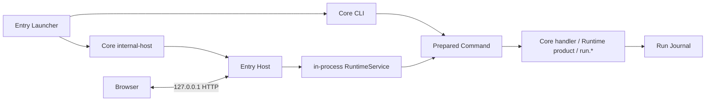

# SWAW Kit Proj 当前事实与演进计划

> 事实基线：2026-08-21。正文只记录当前代码和测试能够证明的行为；尚未实现的内容只进入“行动计划”。

## 1. 结论

Proj 下一阶段的主线不是继续扩张 Command 特例，而是：

> **用 Resource 表达稳定对象，用 Facet 表达对象的方法，用 Resource List 表达集合边；只有身份、安全和全局一致性约束才进入 Core。**

System 生产树已经完成 Resource–Facet 纵向 hard cut，但仍以 backing Command identity 承担执行、DataRoot 与 Journal 身份。`_protocol` 的 Resource–Facet v1 已进入生产 Catalog 作者路径；`.help`、`.check`、`.entry`、`.runtime`、`.module`、`.dev`、`.context` 与 `.runs` 都不再依赖 Command Module manifest。

旧 `<command>/_view/web.json` 与 `swawkit.command-view/web/v4` 已从 Core、Catalog 和 Web 删除。它错误地让 Command 同时拥有布局和 `run.operations`；新 `view/web.json` 只属于 Facet，当前已把 `normal|wide` 列宽接入 Catalog 与 Finder，操作仍由 Facet 语义拥有。

Core 的进入门槛是：至少两个无关领域需要同一不变量，或者领域自行实现会破坏身份、安全或全局一致性。业务参数、状态、迁移、产物格式、深度校验和用户动作留在命令模块。

## 2. 当前系统快照

### 2.1 仓库组成

| 位置 | 当前职责 |
| --- | --- |
| `bootstrap.ps1`、`bootstrap.json`、`_bootstrap/` | 冷启动入口、布局与基础工具链准备 |
| `_launcher/` | C 实现的最小 Entry Launcher |
| `_app/` | Rust Core CLI、Host、RuntimeService、Loopback HTTP 与内嵌 Web UI |
| `_protocol/` | App 与 Native builder 共用的 Rust 协议类型和校验 |
| `_runtime/` | Entry Runtime 的构建、发布和 release 操作 |
| `_toolchain/` | Bootstrap/开发工具链的 PowerShell 实现 |
| `system/` | 随产品发布的 System 命令模块 |
| `_test/` | PowerShell 黑盒、构建、发布和恢复测试 |

当前 `system/` 有 57 个 `swawkit.resource.json`、109 个 `swawkit.facet.json`、86 个 `swawkit.execution.json`，以及 0 个 `swawkit.module.json`。其中 `.context` 是唯一 Native owner，9 个静态子命令通过各自 execute Facet 的 `native-delegate` 复用它的 Release；`contexts` 动态 Collection 与 7 个实例 Facet 模板也全部来自目录协议。`.runs/all` 本地定义 `run` kind 与 2 个实例 Facet 模板；33 个真正会写 Journal 的 Command Resource 各自显式声明 `runs` Collection，并用 Resource Kind ref 精确复用该定义。`.view/source` 已提供只读 View Bundle 解析入口。

仓库当前没有 `_lib/proj/modules/`，因此没有随仓库交付的 `swaw/*` 模块实例；`project/*` 的真实来源是 Entry 绑定项目的 `<projectRoot>/.swaw/`，也不应在本文中写成已经存在的仓库示例。

### 2.2 运行链



Launcher 无参数进入 Host，有参数进入 CLI。Host 直接链接同一 Core library，并在进程内持有 `RuntimeService`；当前不存在独立 Core daemon，也没有 Host/Core named-pipe 命令数据面。Named Event 只承担 Host singleton lease 和 restart ready handshake。

## 3. 命令作者面对的主路径

### 3.1 最小源码结构

```text
<resource>/
├─ swawkit.resource.json     # 唯一 Resource 发现 marker
├─ _help/                    # 可选；zh-CN.txt / en.txt
├─ execute/                  # 可选 Operation Facet
│  ├─ swawkit.facet.json
│  ├─ swawkit.execution.json 或 run.*
│  └─ swawkit.requirements.json
├─ runs/                     # 可选；只有会写 Journal 的命令才显式声明
│  ├─ swawkit.facet.json
│  ├─ swawkit.resource-kind.json
│  └─ swawkit.execution.json
├─ subcommands/              # 可选静态 Collection Facet
│  ├─ swawkit.facet.json
│  └─ <child-resource>/
└─ <domain-facet>/           # 可选 Collection/Projection/Operation
   ├─ swawkit.facet.json
   ├─ swawkit.resource-kind.json
   ├─ swawkit.execution.json
   └─ view/web.json
```

Resource、Facet、Execution、Requirements、Exports、Resource Kind 和 Web View 是按所有权拆开的严格协议；目录名是 selector/Facet id 的单一事实源，JSON 不重复身份。业务 schema、构建步骤、Export 类型和 checker 代码仍不进入 Core authoring 协议。

一个 execute Facet 只能有一个执行来源：规范本地 `run.exe/run.ts/run.py/run.ps1/run.cmd`，或 `swawkit.execution.json`。当前 Facet Execution v2 的实现类型是 `core/runtime/native/native-delegate/invoke`：`native-delegate` 只复用祖先 Native owner 的 Release；`invoke` 让普通 Facet 显式调用另一个 Resource 的 execute Facet。`resource.selector` 只用于动态模板，`resource.route` 只用于已知静态 Resource；结构 Resource 可以没有 execute，`run.py` 目前只诊断、不可执行。

### 3.2 身份与 DataRoot

固定发现来源是：

| space | 来源 | 地址示例 |
| --- | --- | --- |
| System | `_lib/proj/system/` | `.context/add` |
| Module `swaw` | `_lib/proj/modules/` | `swaw/example`，当前仓库无实例 |
| Module `project` | `<projectRoot>/.swaw/` | `project/proj/build/app`，由外部项目提供 |

目录发现与 CLI 执行仍归一到唯一 backing `CommandIdentity`；Resource Route 是一次访问路径，不是第二套存储身份。DataRoot、Native Release 与 Journal 继续只按 backing identity 映射到 `<EntryDataRoot>/modules/<space>/...`，访问 Route 可以进入审计上下文，但不能改变存储键：

```text
<CommandDataRoot>/
├─ state/          # 领域持久状态，可选
├─ locks/          # 领域并发控制，可选
├─ work/           # 候选和中间结果，可选
├─ export/         # 对消费者公开的稳定产物，可选
├─ _state.json     # Provider 发布信号
├─ _runs/          # Core 独占的逻辑命令 Journal
└─ _native/        # Module manager 独占的 Native Release
```

Core 每次调用都重建干净的 Command Environment，移除继承的 `SWAWKIT_HOME` 和 `SWAWKIT_PROJ_*`，再投影 Entry、命令身份、DataRoot、调用目录、module roots 和 native owner 事实。

### 3.3 Native owner 与 Native Delegate

当前唯一 Native owner 是 `.context`，其 9 个子端口使用 `native-delegate`。Native Delegate 保留自己的身份、DataRoot、Help、依赖、Facet 和 Journal，只复用 owner 的不可变 `run.exe` Release。

Owner 必须是同 space 的真实祖先、明确声明 `native` execution；Module owner 还必须同 namespace，且不能跨过中间 Native owner。`native-delegate` 不是 alias、Facet 继承或 IPC。

### 3.4 Help、Facet、Resource Kind 与 Resource List

Help 来自 `_help/zh-CN.txt` 和 `_help/en.txt`，首个非空行进入 Catalog summary，全文进入 detail。支持 `{{COMMAND}}`、`{{ADDRESS}}`、`{{INVOCATION}}`；`.help`、`-h`、`--help` 由 Core 处理，`<target> --help` 交给目标命令。

Facet 由 `swawkit.facet.json` 表达 `collection/projection/operation`；`swawkit.execution.json` 使用同一 Facet Execution v2 的 `invoke` 实现指向目标 Facet，并声明 `resource.selector` 或 `resource.route` 结构化绑定，不再发明第二套 delegate 协议。`swawkit.resource-kind.json` 只有两种互斥形态：本地 `kind` 定义，或指向定义 Collection Facet 的精确 `ref`。Ref 不允许链式引用、本地模板或本地成员；Collection 自己的 resolver、presentation、View 与本次授权仍由引用端拥有。

当前 Runtime 集合 wire 是 `swawkit.resource-list/v2`。每条 `ResourceListing` 同时携带稳定 `identity`、本次访问的 `route`、Collection 内的 `selector`、显示文本，以及本次 Collection 真正授予的 `facetIds`。因此同一个 Run 可以同时经 `$/system::runs/all::R1` 与某命令的 `.../runs::R1` 到达并共享 identity，但两条 listing 会分别实例化自己的 Facet 子集，不能混用授权。

## 4. 八个协议族的当前事实

| 协议族 | 当前主要协议/版本 | 已确认边界 |
| --- | --- | --- |
| Entry 与启动 | Launch Environment `6`；Entry Config/State `v1`；Inventory/Instance/Mutation `v2`；Launcher receipt `v1` | Entry 文件名与 DataRoot 配对是身份；旧 `_entry.json` 仅作显式迁移证据 |
| 发现与身份 | Resource/Facet/Resource Kind `v1`；Resource List `v2`；Catalog `v24` | System 只由规范 Resource marker 发现；identity 标识稳定节点，Route 记录访问与 provenance，backing Command identity 仍是执行与存储身份 |
| 执行与 Delegate | Facet Execution `v2`；Command Environment `3`；Native Execution Contract `v4`；Native Release `v3` | 一个 Facet 一个执行来源；Native Delegate 只复用 owner Release，Invoke 只表达显式 Facet 调用 |
| Help、Resource 与 Web | Help 文件约定；Resource List `v2`；View Source/Bundle Web `v1` | SubjectCollection v3 与旧 Command View Web v4 已删除；`.view/source` 与 `/api/v3/view-bundles` 生成同一封闭 Bundle，Finder 不再从 Catalog 读取 View Source |
| Host 与 Runtime 控制 | Host Runtime/Status/Runtime Status `v3`；HTTP `/api/v2` | Loopback authority、control header 和 generation gate 共同守边界 |
| 发布与更新 | Runtime Release Set `v4`；Framework Command Runtime `v1`；Runtime Cleanup `v1` | staging 校验后发布内容寻址目录，`current` 是原子普通文件 selector |
| Export、依赖与 Check | Provider State `v3`；Dev Settings/State `v1`；CommandCheck `v3`；Dir Exists `v1` | Core 只验证声明、Ready 与路径；业务产物由 Provider/Consumer 深检 |
| Run、Event 与 Journal | live Run `v2`；Journal State/Event `v2`；public Journal `v3`；History `v1`；Event Frame `v1` | owner lock 是活性事实；磁盘 retention/prune 尚未实现 |

协议发生破坏性变化时直接 bump 并 hard cut。只有确有长期价值的持久状态才设计有界迁移；默认不保留双栈或无删除条件的 fallback。

## 5. Resource–Facet 生产主路径

### 5.1 已实现事实

- `swawkit.command-view/web/v4`、Command Catalog 顶级 `view` 字段、`childrenColumnWidth` 和 `runOperations` 已删除，Catalog 已 bump 为 v24；Web 布局只存在于 Facet 的作者 View Source，由 Bundle 解析边界读取，不进入公共 Catalog wire。
- `_protocol` 已定义结构化 `ResourceRoute`、`FacetRoute` 与解析联合类型 `RouteTarget`，语法为 `Resource / Facet :: Resource / Facet`。
- `swawkit.resource-list/v2` 已冻结 `source + resources[]` 的窄 wire；selector 只负责在本次集合中选择，identity、route 与 `facetIds` 分别承担稳定身份、访问 provenance 和局部能力授予。同一个 Resource 可以由不同集合返回，不复制稳定 identity，也不合并各条边的授权。
- 作者协议已拆为 `swawkit.resource/v1`、`swawkit.facet/v1`、`swawkit.resource-kind/v1` 与 `swawkit.facet-execution/v2`。Execution v2 使用 `core/runtime/native/native-delegate/invoke`，不接受旧 `command/delegate` 变体。
- Resource Kind 支持本地定义与精确 Facet Route 引用；Catalog 先解析全部本地定义，再解析引用，因此缺失目标和引用链都会失败为局部诊断，而不会靠 kind 字符串猜 provider。
- Web 协议已定义 `swawkit.view-source/web/v1` 和封闭的 `swawkit.view-bundle/web/v1`，第一片只支持 `resource-list` 与 `normal|wide`；`.context/contexts`、`.runs/all` 当前声明 `wide`。
- 测试 fixture 对齐当前真实执行边界：`.dev` 不可执行；`.dev/bun` 由本地 `run.ps1` 执行；`.dev/bun/mode` 由 Runtime 声明执行。后两者各自拥有 execute Facet。
- 动态 fixture 使用 `kind=context` 与源码侧 Facet 模板；Collection 和实例方法都通过 `invoke` 调用已有 Resource 的 execute Facet。Core 没有通用的运行时目录扫描协议。

Resource 作者协议是生产 Catalog 唯一 reader。Resource marker 一旦出现，整个子树只由 Resource Loader 遍历，声明损坏也不会退回目录猜测。旧 Command Module reader、共享协议类型、Native 发布扫描路径和 Web `module` 投影均已物理删除；旧文档只保留在“不能获得 Catalog membership”的负向测试中。

### 5.2 P1 Loader 纵切事实

- `_app/src/catalog/resource_loader/` 已进入生产构建；`CatalogSnapshot::discover` 对 Resource marker 使用安全 Loader，并把 execute Facet 编译为当前 backing Command executor。
- Loader 对协议文件实施 canonical 大小写、普通文件/目录、reparse point、单目录 512 项、协议文件 64 KiB、确定排序与扫描前后目录复检。
- 错误按最小所有者隔离：坏 View 只移除 View，坏 Facet 只移除该 Facet，坏 Collection 输出只让本次 Facet 解析失败；父 Resource 保持可用并携带诊断。
- `subcommands` 是 Catalog 唯一认可的静态 Command 子资源入口。其他 Collection 的 Resource List 由声明的 `invoke` resolver 返回，再按 Resource Kind 与本次 `facetIds` 校验；Core 不从任意 DataRoot 自动扫描 Resource。
- 只有 `execute` Facet 能直接持有 canonical `run.exe|run.ts|run.py|run.ps1|run.cmd`、`swawkit.execution.json` 的 `core/runtime/native/native-delegate` 实现，以及 `swawkit.requirements.json`。其他作者 Facet和动态 Facet 模板只允许用 `swawkit.execution.json` 的 `invoke` 调用另一个 Resource 的 execute Facet；静态成员只允许出现在 `subcommands`。
- 当前 Catalog golden test 已证明：`.check -> $/system::check`、`.check/dir -> .../subcommands::dir`、`.check/dir/exists -> .../subcommands::exists`，以及既有 `.dev` 三层映射；Resource Route 只是投影，DataRoot 仍由 backing `CommandIdentity` 派生。
- Loader 已从同一 Collection 快照生成 `ResourceList` 与 `ViewBundle`。`RouteResolver`、HTTP Facet resolution、`/api/v3/view-bundles` 与 `.view/source` 共用 Resource List 解析及动态 membership 校验；Finder 已删除 Subject adapter，并只从 View Bundle 同时取得布局与 Resource List。未声明 `view/web.json` 时平台生成 `normal + resource-list` 默认视图；DataRoot 仍使用 backing Command identity。
- Core 不再根据“命令可执行”自动合成 `runs` Facet。33 个会进入 Journal 的生产 Command Resource 各自拥有三份窄声明：Collection、指向 `$/system::runs/all` 的 Kind ref，以及通过 `resource.route` 调用 `.runs` query 的 Invoke；只读 Core 命令与控制命令没有虚假的 Runs 能力。

### 5.3 目标作者结构

```text
dev/
├─ swawkit.resource.json
└─ subcommands/
   ├─ swawkit.facet.json
   ├─ view/web.json
   └─ bun/
      ├─ swawkit.resource.json
      ├─ execute/
      │  ├─ swawkit.facet.json
      │  └─ run.ps1
      └─ subcommands/
         ├─ swawkit.facet.json
         └─ mode/
            ├─ swawkit.resource.json
            └─ execute/
               ├─ swawkit.facet.json
               └─ swawkit.execution.json
```

扫描器按父节点类型和 marker 工作，不依赖 `_facets/`、`_members/` 包装：

- Resource 的直接子目录只有含 `swawkit.facet.json` 才是 Facet。
- Collection Facet 的直接子目录只有含 `swawkit.resource.json` 才是静态 owned Resource。
- `view/` 是 Facet 内保留的表示协议目录，不是 `::` 可选择的集合成员。
- Facet 目录名和 Resource selector 来自目录名，JSON 不重复保存身份。
- `swawkit.resource.json` 声明节点；“listed”属于集合边，因此不增加 `swawkit.listed.json` 第二模式。

文件增量保持线性且按能力付费：一个结构 Resource 是 1 个 marker；增加 execute 是 Facet + 实现 2 个文件，Requirement 可选；增加普通方法是 Facet + invoke 2 个文件，Web View 可选；一个动态实例方法模板也是 Facet + invoke 2 个文件。当前最大的重复基数是 33 个命令级 `runs` 各 3 个声明，共 99 个文件；先用布局守卫保证三份语义一致，不在协议未稳定时引入生成器、继承或新的 ref 模式。

### 5.4 Route 与动态 Resource

Canonical grammar 是：

```text
route := root-resource ( "/" facet-id ( "::" selector )? )*
```

示例：

```text
$/system::dev/subcommands::bun/subcommands::mode/execute
$/system::context/contexts::release-check/overview
```

`/facet` 永远是方法；只有 Collection Facet 后允许 `::selector`。CLI 已接受显式 `$...` FacetRoute 作为第一个参数：Collection/Projection 返回经协议校验的 JSON 文档，Operation 归一为 backing command 与绑定参数后进入原有执行、依赖和 Journal 边界。Web command-run 也已 hard cut 为 `/api/v3/command-runs { route, arguments }`：客户端只提交 canonical Operation Route 与用户追加参数，selector、固定参数、动态 membership 和本次 `facetIds` 都由 Host 在同一 Entry Config/Catalog 快照内重新解析；旧 `/api/v2/command-runs` 与公开的 `address + arguments` 启动入口已删除。`.dev/subcommands::bun/execute` 暂不作为输入，因为它与现有 `.dev/bun` CommandAddress 共享前缀；在 direct Command CLI hard cut 前，不能靠 Catalog 猜测同一字符串究竟是 Resource 还是 Facet。`CommandIdentity`、DataRoot、Journal 与 Native contract 有意保持为唯一 backing identity。

`swawkit.resource-kind.json` 使用 singular `kind`，例如 Collection Facet `contexts` 产生 `kind=context` 的 Resource。本地定义与引用的最小形态分别是：

```json
{"schema":"swawkit.resource-kind/v1","kind":"run"}
{"schema":"swawkit.resource-kind/v1","ref":"$/system::runs/all"}
```

Ref 复用目标定义的 kind identity 与完整实例 Facet 模板，但不会镜像目标 Collection 的 resolver、presentation 或 View。`::` 选择当前 Collection resolver 返回的 Resource；结果既可以来自静态 `subcommands`，也可以来自领域查询或 Core 聚合，但不能被定义成通用“扫目录”操作。

### 5.5 View 边界

`<facet>/view/web.json` 描述该 Facet 所占列的 Web View Source。它不声明 resolver、arguments、confirmation、raw HTML、脚本、任意 CSS 或远程资源。

平台入口 `.view/source <FacetRoute>` 已使用统一 `RouteResolver` 生成同一 Catalog 快照下的 View Source 与 Resource List Bundle。这里 `FacetRoute` 是“一个 `ResourceRoute` 加末端 Facet”的逻辑方法地址，不是 Command identity；HTML render 等 Bundle 稳定后再决定。`::view` 不进入 grammar，因为 `::` 只选择 Collection 的结果 Resource。

## 6. 平台与模块责任

| 事项 | Core / 平台 | 命令模块 |
| --- | --- | --- |
| 地址、来源根、Resource/Facet 声明 | 统一映射与校验 | 声明能力 |
| 参数、业务状态、迁移 | 不理解 | 完全拥有 |
| DataRoot 与保留路径 | 映射并守边界 | 管理 state/work/export |
| 进程、Job、取消、Journal | 统一 | 输出事件与退出码 |
| Provider Ready | 读取并递归断言 | 原子发布 generation |
| Export 格式、hash、服务存活 | 不理解 | 发布并在使用边界深检 |
| Help、Facet、Resource | 聚合、路由并校验本次 listing 授权 | 内容、对象与动作 |
| 安装、修复、领域迁移 | 不代管 | 提供显式、有界流程 |

发布主路径是 `work/ 构建与自检 -> export/ 原子发布 -> Ready State`；消费主路径是 `读取 Ready -> 深检产物 -> 复读同一 State -> 使用已读取/固定的资源`。State 复读只能证明校验期间 generation 未变化，不是资源 lease。

## 7. 模块开发顺序

1. 定义 bounded context、命令树和用户可见端口。
2. 定义领域自己的 state/work/export、原子提交点和失败恢复。
3. 用最小 `run.*` 或 Native owner/delegate 完成业务闭环。
4. 加入 Help；只有 UI 真正需要动态对象投影时才声明 Facet/Resource Kind。
5. 只有真实跨模块消费时才增加 Resource Export 与 execute-Facet Requirement，同时实现 Provider checker 与 Consumer use-time validation。
6. 先用 CLI 黑盒证明行为，再验证 Catalog/Web、升级、取消和 Journal 边界。
7. 发现至少两个无关领域重复且无法安全自治的约束后，才提炼 Core 协议。

完成标准：身份/DataRoot 同源；一个执行来源；状态和发布只有一个事实源；失败保持旧 Release 可用；普通运行不安装、不构建、不隐式修复；领域测试和至少一个真实 CLI 黑盒通过。

## 8. 下一步行动计划

### P0：Resource–Facet 协议基础（已完成）

- 旧 Command View Web v4 已纵向删除，Catalog v24、Rust 与 Web 测试通过。
- Resource Route、Resource List v2、作者 marker、动态 Kind、Facet Execution 与 View Source/Bundle 已进入共享 `_protocol`。
- 静态和动态 fixture 证明扁平目录语法；生产 Loader 已扫描完整 System tree。DataRoot 有意继续由稳定 backing Command identity 派生，尚不以访问 Route 为键。
- `.help` 中错误宣称的 `.h` 已移除；当前保留 `.help`、`-h`、`--help`。

### P1：安全 Loader 与 Catalog 投影（已进入生产）

- fixture Loader 已覆盖静态 Resource、Resource Kind/Facet 模板、execute 的本地与声明式实现、普通 Facet 的 invoke、局部诊断与 Web View Bundle。
- 当前 Catalog 身份已通过 golden projection 映射到 Resource Route；Backing `CommandIdentity`、DataRoot 与执行身份保持不变。
- `.help` 是首个真实生产纵切：旧 Manifest 已删除，Core execution 只来自 `help/execute/swawkit.execution.json`。
- `.check` 是首个带嵌套静态子资源的完整域：旧的 3 个 Manifest 已删除；`.check/dir` 只由 `subcommands` Collection 产生，`.check` 与 `.check/dir/exists` 的执行只来自各自 `execute` Facet。
- `.entry` 的 8 个旧 Manifest 已删除；一个可执行根、一个结构子资源和 6 个可执行子资源都由同一 Resource–Facet 结构表达，原有 Core handler 与 Help 归属不变。
- `.runtime` 的 5 个旧 Manifest 已删除；状态根、cleanup 与两个 Host 动作是 Operation Facet，`host` 只保留结构与 Help。
- `.module` 的 3 个旧 Manifest 已删除；`instantiate/status` 首次以 Runtime execute Facet 进入生产。Catalog 已把稳定 Resource `directory` 与具体 `executorDirectory` 分开，源码所有权、环境变量和 Native owner 不再错误指向 `execute/`。
- `.dev` 的 24 个旧 Manifest 已删除；14 个 Runtime、7 个本地 PowerShell execute 与 3 个结构 Resource 使用同一目录模型。execute Facet 的 `swawkit.requirements.json` 用 Resource Route 指向 Provider，Resource 的 `swawkit.exports.json` 声明 Export；Catalog 只在 backing 执行边界编译为现有 Command dependency。
- `.context` 的 10 个旧 Manifest 已删除；Native owner 与 9 个 `native-delegate` 的所有权来自 execute Facet。`contexts` Collection 声明 `kind=context`，7 个实例方法模板各自在目录内拥有 presentation 与 invoke execution。
- `.runs` 的最后 1 个旧 Manifest 已删除；`all` Collection 本地声明 `kind=run`。33 个 Journal-producing Command Resource 显式拥有 `runs` Collection，并精确 ref `$/system::runs/all`；同一 run 经全局或命令集合到达时共享底层 Journal identity，但保留各自访问 Route。
- System 生产树已完成 57/57 Resource hard cut；迁移不承担旧作者格式的外部兼容。

### P2：删除旧作者主路径（已完成）

- Command Module parser、校验、共享类型和 fixture 已物理删除；内部声明类型已收口为 Resource/Facet 语义。
- Catalog v24 不再输出 `module` 或 Facet View Source；Web detail 不再合成旧依赖 UI。
- Catalog 与 Web 的默认静态/执行 Facet 已统一为作者词汇 `subcommands/execute`，不再投影成 `children/run`；`run` 只保留为执行面板的 renderer 名称。
- Native 发布扫描器只沿 `subcommands` Collection 遍历，并只从 execute Facet 建立 Native/Delegate 域。
- CLI、Runtime 黑盒 fixture 与布局守卫只会作者 Resource/Facet；布局守卫同时验证本地 execute 脚本引用的真实目标。
- 旧 `swawkit.module.json` 只保留在拒绝旧协议的负向测试输入中，不是兼容入口。

### P3：统一 Resource List Runtime wire 与 Finder（已完成）

1. `RouteResolver` 已收口 Catalog projection、动态 membership、Resource Kind capability、resolver return protocol 和 View Bundle 生成；HTTP Facet resolution 与 `.view/source` 共用该服务。
2. `.view/source <FacetRoute>` 已输出封闭的 `swawkit.view-bundle/web/v1`；CLI 与 Host Runtime query 使用同一实现，不增加旧协议兼容入口。
3. `swawkit.resource-list/v2` 已进入 `.context`、全局/命令级 `.runs`、HTTP 与 Web Finder；`ResourceListing` 的 identity、route、selector 与 `facetIds` 已由 Rust/JS 两侧严格校验。
4. Catalog 已 hard cut 为 v24，`resourceKinds/resourceKind` 与 `resource.selector` 成为唯一词汇；旧 SubjectCollection、SubjectKind、`ref/via/canonicalRef` Web 模型及资源文件已物理删除。
5. Finder 已通过 `/api/v3/view-bundles` 直接消费封闭 View Bundle；布局与 Resource List 来自同一 Catalog/Collection 快照，Catalog 不再公开 Facet View Source。`view/web.json` 保持可选，未声明时平台使用 `normal + resource-list` 默认视图。
6. CLI 已接受 canonical `$...` FacetRoute：`$/system::dev/subcommands::bun/execute` 归一为 `.dev/bun`，动态 Operation 会先重新解析 Collection membership 与本次 `facetIds`，再绑定 selector；静态/动态 Route 都不会创建第二份 DataRoot、Release 或 Journal identity。
7. Web command-run 已 hard cut 为 FacetRoute：Host 在一个准备任务中固定 Entry Config/Catalog，让动态 Collection 查询、局部 `facetIds` 授权、selector/固定参数绑定、依赖检查与 backing execution preparation 共用同一快照；Web 只发送用户 tail，不能再指定或覆盖 resolver address/固定参数。HTTP 黑盒已证明移除局部 `add` grant 后，同一 Context Route 不会启动 backing operation。

### 暂不做

- Journal retention/prune：等 Resource–Facet/Route 协议稳定后，再冻结 count/age/bytes、active-owner、不可删除条件及 preview/apply；不加入后台自动删除。
- Host/Core named-pipe 数据面。
- 通用 Export Contract、类型注册表或 Artifact registry。
- Playbook DSL 与祖先继承的 `.var/.secret` 环境。
- 没有第二个真实需求的 Core check 原语。
- 受管工具链未闭环前的 `run.py`。

## 9. 架构护栏

评审新的 Core 能力时只问三件事：

1. 理想的自治命令模块为什么不能在领域内解决它？
2. 它是否保护至少两个无关领域共享的身份、安全或一致性不变量？
3. 它是否有单一事实源、原子授予点、真实第二使用者和明确失败边界？

长期目标不是让一切都成为协议，而是让协议只承担公共秩序：**Core 为一致性付费，Module 为领域变化付费。**
